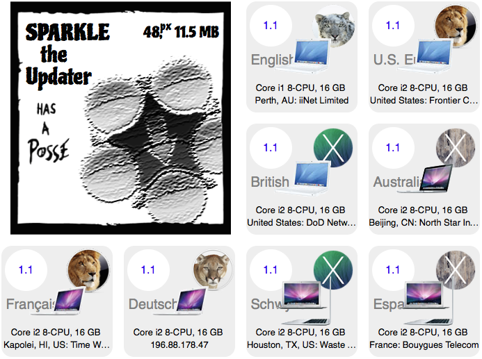

# Sparkle Posse

Visualizer for Sparkle update framework's appcast profile logs. See the
[DEMO](http://habilis.net/sparkle-posse/demo/)

## Requirements

- PHP on host with zgrep
- 1 week of web server logs

## Install via Composer

curl -sS https://getcomposer.org/installer | php
